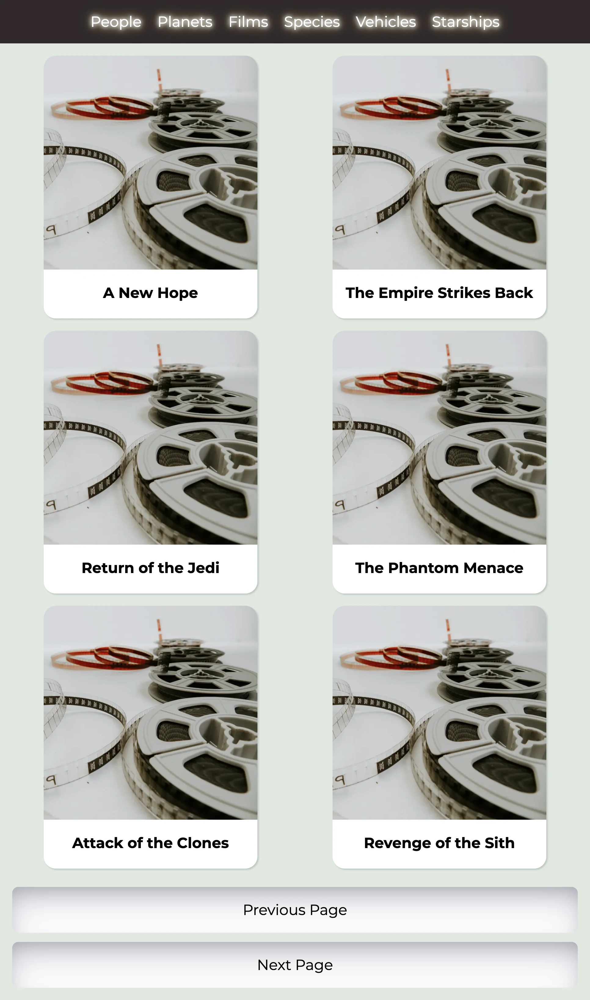

## Getting Started

First, run the development server:

```bash
npm i && npm run dev
```

Open [http://localhost:3000](http://localhost:3000) with your browser to see the result.

Testing:

```bash
npm run test
```

Testing coverage:

```bash
npm run test:coverage
```

E2E test:

```bash
npm run cypress:open
```

## Visit the web application

Check out the [Stars Wars Wiki](https://starwarswikird.vercel.app/) on Vercel.



